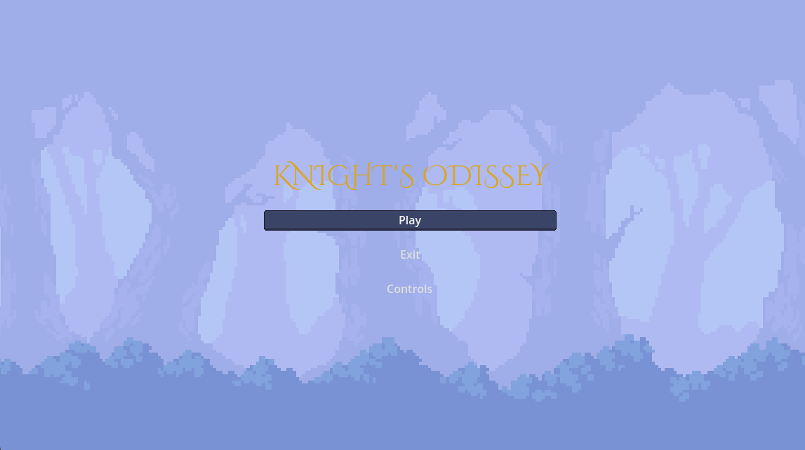
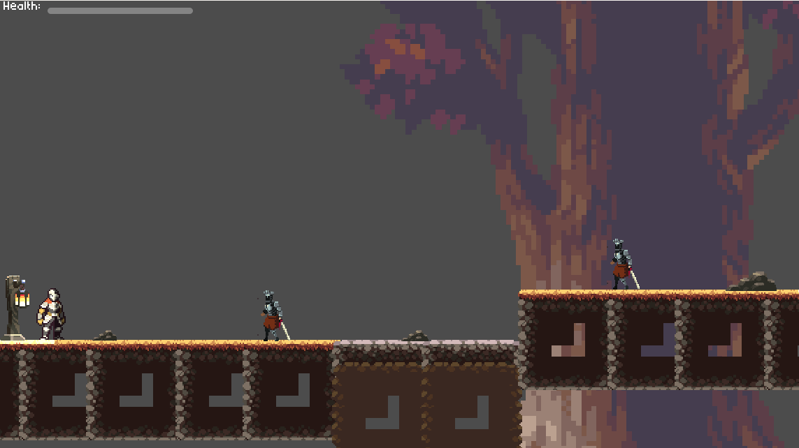
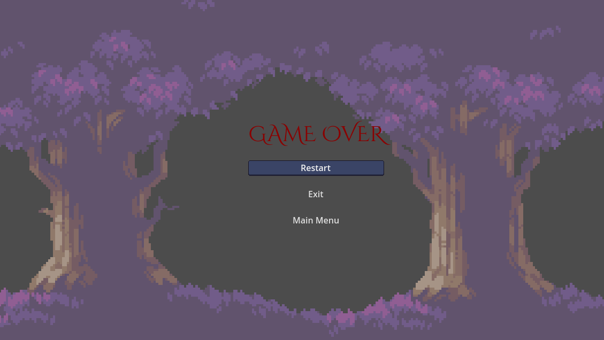
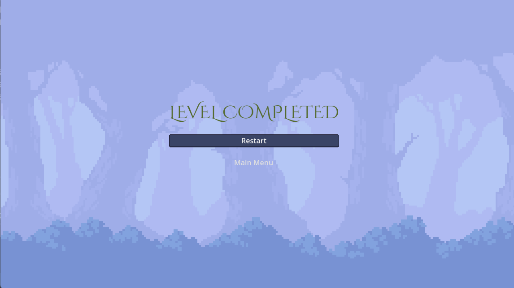

# 🏰 The Knight's Odyssey

### 🎮 Descripción del Proyecto
**"The Knight's Odyssey"** es un juego de plataformas 2D desarrollado en **Godot 4.3** como parte de la materia **Desarrollo de Videojuegos 2**. El juego busca demostrar la implementación de mecánicas clave como **animaciones fluidas**, **persistencia de datos**, **sonidos envolventes**, **diseño de niveles** y el uso de **patrones de diseño** para organizar el código eficientemente.

---

## ⚔️ Características Principales

### 🔹 **1. Animaciones**
- Implementación de animaciones **frame by frame** y **blend trees** para el movimiento del personaje principal (caminar, saltar, ataque).
- Uso del **AnimationPlayer** y **State Machines** de Godot para transiciones suaves entre estados.

### 🔹 **2. Persistencia de Datos**
- Los jugadores pueden **guardar y cargar** su configuración de controles preferidos.
- Uso del sistema de **archivos JSON** en Godot para almacenar datos de forma persistente.

### 🔹 **3. Sonidos**
- Efectos de sonido (SFX) para acciones como salto, ataque y daño.
- Música de fondo que se adapta a diferentes niveles.
- Implementación de **AudioStreamPlayer2D** y **AudioStreamPlayer** para gestionar sonidos.

### 🔹 **4. Diseño de Nivel**
- Niveles construidos con **TileMap** y decorados con elementos visuales de estilo pixel art.
- Uso de **parallax layers** para crear profundidad y dinamismo visual.
- Obstáculos y enemigos con comportamientos predefinidos.

### 🔹 **5. Patrones de Diseño**
- **Singletons (Autoload)**: Implementación de un gestor global para configuraciones y sonidos.
- **State Pattern**: Gestión de los estados del personaje (idle, caminar, saltar, atacar).
- **Componentes**: Separación de lógica y funcionalidades en scripts individuales para cada objeto.

---

## 🛠️ Tecnologías Utilizadas
- **Motor de Juego**: Godot Engine 4.3.
- **Lenguaje**: GDScript.
- **Gráficos**: Sprites y TileSets estilo pixel art.
- **Sonido**: Archivos **WAV** y **OGG**.

---

---

## 🎥 Capturas de Pantalla
**Menú Principal**  


**Nivel 1: The Forest of Trials**  


**Game over**  


**Level completed**  


---

## 🚀 Instalación y Ejecución
1. Clona el repositorio:  
   ```bash
   git clone https://github.com/JuantMartinez17/TheKnightsOdissey_OnGodot
